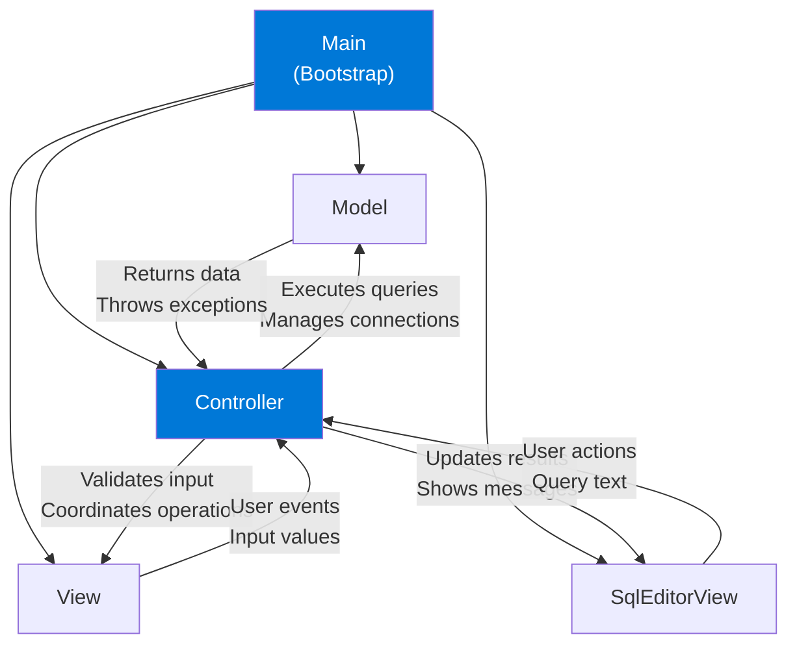

This page provides comprehensive documentation for each major component in the MySQL SQL Editor architecture.

## Component Overview

<CardGroup cols={3}>
  <Card title="Main" icon="play" color="#0078D7" href="#main">
    Application entry point
  </Card>
  <Card title="Model" icon="database" color="#0078D7" href="#model">
    Data access layer
  </Card>
  <Card title="View" icon="window" color="#0078D7" href="#view">
    Login interface
  </Card>
  <Card title="SqlEditorView" icon="code" color="#0078D7" href="#sqleditorview">
    SQL editor interface
  </Card>
  <Card title="Controller" icon="gears" color="#0078D7" href="#controller">
    Application coordinator
  </Card>
</CardGroup>

---

## Main

**Package**: `com.app`  
**File**: `Main.java`  
**Line Reference**: Main.java:15-38

### Purpose

The Main class serves as the application entry point. It initializes all MVC components and establishes the initial application state.

### Class Structure

```java
public class Main {
    public static void main(String[] args)
}
```

### Methods

<Accordion title="main(String[] args)">
  **Signature**: `public static void main(String[] args)`
  
  **Parameters**:
  - `args` - Command line arguments (not utilized in this implementation)
  
  **Returns**: `void`
  
  **Description**:
  
  Entry point for the application. Instantiates the Model, both View components, hides the editor view initially, and creates the Controller to wire everything together.
  
  **Implementation**:
  
  ```java
  public static void main(String[] args) {
      // Instantiate the model
      Model model = new Model();

      // Instantiate the login view
      View loginView = new View();

      // Instantiate the SQL editor view
      SqlEditorView editorView = new SqlEditorView();

      // Hide the editor initially
      editorView.setVisible(false);

      // Create the controller, connecting model and views
      new Controller(loginView, editorView, model);
  }
  ```
</Accordion>

### Dependencies

- `com.app.Model.Model`
- `com.app.View.View`
- `com.app.View.SqlEditorView`
- `com.app.Controller.Controller`

### Role in System

Main orchestrates the bootstrap sequence and ensures all components are created in the correct order. The Controller is created last so it can reference all other components when setting up event listeners.

---

## Model

**Package**: `com.app.Model`  
**File**: `Model.java`  
**Line Reference**: Model.java:12-192

### Purpose

The Model class is the **data access layer** responsible for all database interactions. It manages JDBC connections, executes SQL queries, retrieves metadata, and transforms database results into UI-friendly formats.

### Class Structure

```java
public class Model {
    private Connection conexion;
}
```

### Instance Variables

- `private Connection conexion` - Active JDBC connection to the MySQL database

### Methods

<Accordion title="obtenerTodasLasBasesDatos()">
  **Signature**: `public List<String> obtenerTodasLasBasesDatos(String host, String usuario, String password) throws SQLException`
  
  **Parameters**:
  - `host` - MySQL server address (e.g., "localhost" or "127.0.0.1")
  - `usuario` - Database username
  - `password` - Database password
  
  **Returns**: `List<String>` - List of database names (excluding system databases)
  
  **Throws**: `SQLException` - If connection or query fails
  
  **Description**:
  
  Connects to the MySQL server and retrieves all available databases, filtering out system databases (information_schema, mysql, performance_schema, sys).
  
  **Implementation Detail**:
  
  ```java
  String url = "jdbc:mysql://" + host + ":3306/?useSSL=false";

  try (Connection conn = DriverManager.getConnection(url, usuario, password);
       Statement stmt = conn.createStatement();
       ResultSet rs = stmt.executeQuery("SHOW DATABASES")) {

      while (rs.next()) {
          String nombreBD = rs.getString(1);
          if (!nombreBD.matches("information_schema|mysql|performance_schema|sys")) {
              basesDatos.add(nombreBD);
          }
      }
  }
  ```
  
  <Info>
    This method creates a temporary connection to retrieve the database list and doesn't affect the instance's `conexion` field.
  </Info>
</Accordion>

<Accordion title="conectar()">
  **Signature**: `public void conectar(String host, String database, String usuario, String password) throws SQLException`
  
  **Parameters**:
  - `host` - MySQL server address
  - `database` - Specific database name to connect to
  - `usuario` - Database username
  - `password` - Database password
  
  **Returns**: `void`
  
  **Throws**: `SQLException` - If connection fails
  
  **Description**:
  
  Establishes a persistent connection to a specific MySQL database. The connection is stored in the `conexion` instance variable for subsequent queries.
  
  **Implementation Detail**:
  
  ```java
  conexion = DriverManager.getConnection(
      "jdbc:mysql://" + host + ":3306/" + database + "?useSSL=false",
      usuario,
      password
  );
  ```
  
  **Usage Example**:
  
  ```java
  model.conectar("localhost", "myapp_db", "root", "password123");
  ```
</Accordion>

<Accordion title="desconectar()">
  **Signature**: `public void desconectar() throws SQLException`
  
  **Parameters**: None
  
  **Returns**: `void`
  
  **Throws**: `SQLException` - If closing the connection fails
  
  **Description**:
  
  Closes the active database connection if one exists and is not already closed.
  
  **Implementation Detail**:
  
  ```java
  if (conexion != null && !conexion.isClosed()) {
      conexion.close();
  }
  ```
</Accordion>

<Accordion title="obtenerTablasDeBaseDatos()">
  **Signature**: `public List<String> obtenerTablasDeBaseDatos() throws SQLException`
  
  **Parameters**: None
  
  **Returns**: `List<String>` - List of table names in the currently connected database
  
  **Throws**: `SQLException` - If metadata retrieval fails
  
  **Description**:
  
  Retrieves all table names from the currently connected database using JDBC metadata.
  
  **Implementation Detail**:
  
  ```java
  List<String> tablas = new ArrayList<>();
  if (conexion != null && !conexion.isClosed()) {
      DatabaseMetaData metaData = conexion.getMetaData();
      String catalogoActual = conexion.getCatalog();
      try (ResultSet rs = metaData.getTables(catalogoActual, null, "%", 
                                             new String[]{"TABLE"})) {
          while (rs.next()) {
              tablas.add(rs.getString("TABLE_NAME"));
          }
      }
  }
  return tablas;
  ```
  
  <Note>
    This method requires an active connection established via `conectar()`.
  </Note>
</Accordion>

<Accordion title="ejecutarConsulta()">
  **Signature**: `public DefaultTableModel ejecutarConsulta(String query) throws SQLException`
  
  **Parameters**:
  - `query` - SQL query string to execute
  
  **Returns**: `DefaultTableModel` - Swing table model containing query results
  
  **Throws**: `SQLException` - If query execution fails
  
  **Description**:
  
  Executes any SQL query (SELECT, INSERT, UPDATE, DELETE, CREATE, etc.) and returns the results as a `DefaultTableModel` suitable for display in a JTable.
  
  **Behavior**:
  
  - **SELECT queries**: Returns the result set as a table model with columns and rows
  - **Modification queries** (INSERT, UPDATE, DELETE): Executes the query, extracts the affected table name, and returns the updated table contents
  - **Other queries** (CREATE, DROP, TRUNCATE): Returns a single-column table showing affected row count
  
  **Implementation Detail**:
  
  ```java
  try (Statement stmt = conexion.createStatement()) {
      String trimmedQuery = query.trim().toLowerCase();
      DefaultTableModel modelo = new DefaultTableModel();

      if (trimmedQuery.startsWith("select")) {
          // Handle SELECT - return result set
          try (ResultSet rs = stmt.executeQuery(query)) {
              ResultSetMetaData meta = rs.getMetaData();
              int columnas = meta.getColumnCount();

              for (int i = 1; i <= columnas; i++) {
                  modelo.addColumn(meta.getColumnName(i));
              }

              while (rs.next()) {
                  Object[] fila = new Object[columnas];
                  for (int i = 0; i < columnas; i++) {
                      fila[i] = rs.getObject(i + 1);
                  }
                  modelo.addRow(fila);
              }
          }
      } else {
          // Handle INSERT, UPDATE, DELETE, etc.
          int filasAfectadas = stmt.executeUpdate(query);
          String tabla = extraerNombreTabla(trimmedQuery);
          // Returns updated table or affected rows message
      }
      
      return modelo;
  }
  ```
  
  **Usage Example**:
  
  ```java
  DefaultTableModel results = model.ejecutarConsulta("SELECT * FROM users");
  table.setModel(results);
  ```
</Accordion>

<Accordion title="extraerNombreTabla()">
  **Signature**: `private String extraerNombreTabla(String query)`
  
  **Parameters**:
  - `query` - Lowercase SQL query string
  
  **Returns**: `String` - Table name if identifiable, otherwise `null`
  
  **Description**:
  
  Helper method that extracts the table name from various SQL statements (CREATE TABLE, INSERT INTO, UPDATE, DELETE FROM, TRUNCATE TABLE) to enable showing updated table contents after modifications.
  
  **Supported Patterns**:
  
  - `CREATE TABLE table_name ...`
  - `INSERT INTO table_name ...`
  - `UPDATE table_name ...`
  - `DELETE FROM table_name ...`
  - `TRUNCATE TABLE table_name`
  
  **Implementation Example**:
  
  ```java
  if (query.startsWith("insert into")) {
      String[] partes = query.split("\\s+");
      if (partes.length >= 3) {
          return partes[2].replaceAll("`", "");
      }
  }
  ```
</Accordion>

### Dependencies

- `java.sql.*` - JDBC for database connectivity
- `javax.swing.table.DefaultTableModel` - For UI data representation

### Role in System

The Model is the **single source of truth** for all database operations. It abstracts away JDBC complexity and provides clean, high-level methods that the Controller can call without worrying about SQL implementation details.

---

## View

**Package**: `com.app.View`  
**File**: `View.java`  
**Line Reference**: View.java:11-253

### Purpose

The View class implements the **login interface** where users enter connection credentials and select a database.

### Class Structure

```java
public class View extends JFrame {
    // UI Components
    private JTextField txtUsuario;
    private JPasswordField txtPassword;
    private JComboBox<String> cmbServidores;
    private JComboBox<String> cbBasesDatos;
    private JButton btnConectar;
    private JButton btnSalir;
    private JButton btnActualizarBases;
    private JLabel lblEstado;
    private JLabel lblTitulo;
    
    // Color scheme
    private final Color COLOR_FONDO = new Color(245, 245, 245);
    private final Color COLOR_PRIMARIO = new Color(0, 120, 215); // #0078D7
    private final Color COLOR_SECUNDARIO = new Color(100, 180, 255);
    private final Color COLOR_TEXTO = new Color(60, 60, 60);
    private final Color COLOR_ERROR = new Color(220, 50, 50);
}
```

### Constructor

<Accordion title="View()">
  **Signature**: `public View()`
  
  **Description**:
  
  Constructs the login window with all UI components, applies custom styling, and sets up the layout using `GridBagLayout`.
  
  **Window Configuration**:
  
  ```java
  setTitle("Conexión a MySQL");
  setSize(500, 400);
  setDefaultCloseOperation(JFrame.EXIT_ON_CLOSE);
  setLocationRelativeTo(null); // Center on screen
  ```
  
  **UI Components Created**:
  
  - Server selection combo box (localhost, 127.0.0.1)
  - Username text field
  - Password field
  - Database selection combo box with refresh button
  - Connect and Exit buttons
  - Status label for error messages
</Accordion>

### Methods

<Accordion title="Getter Methods">
  **User Input Retrieval**:
  
  ```java
  public String getUsuario()                    // View.java:188
  public String getPassword()                   // View.java:191
  public String getServidor()                   // View.java:194
  public String getBaseDatosSeleccionada()      // View.java:197
  ```
  
  **Button Access**:
  
  ```java
  public JButton getBtnConectar()               // View.java:200
  public JButton getBtnSalir()                  // View.java:203
  public JButton getBtnActualizarBases()        // View.java:206
  ```
  
  These methods allow the Controller to retrieve user input and register event listeners.
</Accordion>

<Accordion title="setBasesDatos()">
  **Signature**: `public void setBasesDatos(List<String> bases)`
  
  **Parameters**:
  - `bases` - List of database names to populate the dropdown
  
  **Returns**: `void`
  
  **Description**:
  
  Updates the database selection combo box with a new list of databases.
  
  **Implementation**:
  
  ```java
  public void setBasesDatos(List<String> bases) {
      cbBasesDatos.removeAllItems();
      bases.forEach(cbBasesDatos::addItem);
  }
  ```
</Accordion>

<Accordion title="mostrarError()">
  **Signature**: `public void mostrarError(String mensaje)`
  
  **Parameters**:
  - `mensaje` - Error message to display
  
  **Returns**: `void`
  
  **Description**:
  
  Displays an error message in red text below the form fields.
  
  **Implementation**:
  
  ```java
  public void mostrarError(String mensaje) {
      lblEstado.setText(mensaje);
  }
  ```
</Accordion>

<Accordion title="limpiarEstado()">
  **Signature**: `public void limpiarEstado()`
  
  **Returns**: `void`
  
  **Description**:
  
  Clears the error message label.
  
  **Implementation**:
  
  ```java
  public void limpiarEstado() {
      lblEstado.setText(" ");
  }
  ```
</Accordion>

<Accordion title="bloquearInterfaz()">
  **Signature**: `public void bloquearInterfaz(boolean bloquear)`
  
  **Parameters**:
  - `bloquear` - `true` to disable UI, `false` to enable
  
  **Returns**: `void`
  
  **Description**:
  
  Enables or disables all input components and buttons. Used during asynchronous operations to prevent multiple simultaneous requests.
  
  **Implementation**:
  
  ```java
  public void bloquearInterfaz(boolean bloquear) {
      cmbServidores.setEnabled(!bloquear);
      txtUsuario.setEnabled(!bloquear);
      txtPassword.setEnabled(!bloquear);
      cbBasesDatos.setEnabled(!bloquear);
      btnActualizarBases.setEnabled(!bloquear);
      btnConectar.setEnabled(!bloquear);

      Color bg = bloquear ? new Color(240, 240, 240) : Color.WHITE;
      cmbServidores.setBackground(bg);
      txtUsuario.setBackground(bg);
      txtPassword.setBackground(bg);
      cbBasesDatos.setBackground(bg);
  }
  ```
</Accordion>

<Accordion title="estilizarBoton()">
  **Signature**: `private void estilizarBoton(JButton boton, boolean primario)`
  
  **Parameters**:
  - `boton` - Button to style
  - `primario` - `true` for primary button style, `false` for secondary
  
  **Returns**: `void`
  
  **Description**:
  
  Applies custom styling including colors, fonts, and hover effects to buttons.
  
  **Features**:
  
  - Primary buttons: #0078D7 background, white text, larger size
  - Secondary buttons: Lighter blue background, dark text
  - Hover effect: Darkens background on mouse enter
</Accordion>

### Dependencies

- `java.awt.*` - Layout and color management
- `javax.swing.*` - UI components
- `java.util.List` - Database list parameter

### Role in System

The View provides the **initial user interface** for authentication. It collects credentials, allows database selection, and displays connection status. The Controller registers listeners on View's buttons to handle user interactions.

---

## SqlEditorView

**Package**: `com.app.View`  
**File**: `SqlEditorView.java`  
**Line Reference**: SqlEditorView.java:15-318

### Purpose

The SqlEditorView class implements the **SQL editor interface** where users write queries, execute them, and view results.

### Class Structure

```java
public class SqlEditorView extends JFrame {
    // Main components
    private JTextArea txtConsulta;
    private JTable tblResultados;
    private JButton btnEjecutar;
    private JButton btnLimpiar;
    private JButton btnRefrescarTablas;
    private JTextField txtBaseDeDatos;
    private JList<String> listaTablas;
    private DefaultListModel<String> modeloListaTablas;
    private JLabel lblMensajeSistema;
    private JButton btnCambiarBD;
    private JButton btnActualizarBD;
    
    // Styling constants
    private final Color COLOR_FONDO = new Color(245, 245, 245);
    private final Color COLOR_PRIMARIO = new Color(0, 120, 215);
    private final Color COLOR_SECUNDARIO = new Color(100, 180, 255);
    private final Color COLOR_TEXTO = new Color(60, 60, 60);
    private final Color COLOR_BORDE = new Color(200, 200, 200);
    private final Font FUENTE_NORMAL = new Font("Segoe UI", Font.PLAIN, 12);
    private final Font FUENTE_MONOSPACE = new Font("Consolas", Font.PLAIN, 14);
    private final Font FUENTE_TITULO = new Font("Segoe UI", Font.BOLD, 14);
}
```

### Constructor

<Accordion title="SqlEditorView()">
  **Signature**: `public SqlEditorView()`
  
  **Description**:
  
  Constructs the SQL editor window with a split-pane layout: top section for query input and controls, bottom section for results display.
  
  **Window Configuration**:
  
  ```java
  setTitle("Editor SQL - MySQL Client");
  setSize(950, 670);
  setDefaultCloseOperation(JFrame.EXIT_ON_CLOSE);
  setLocationRelativeTo(null);
  ```
  
  **Layout Structure**:
  
  - **Top Panel**: SQL query text area with monospace font, database selector, action buttons, and table list
  - **Bottom Panel**: Results table and system message label
  - **Split Pane**: Vertical divider allowing resizing between top and bottom sections
  
  **Interactive Features**:
  
  - Double-click on a table name generates `SELECT * FROM table_name LIMIT 100` query
  - Monospace font (Consolas) for SQL query area
  - Resizable columns in results table
</Accordion>

### Methods

<Accordion title="Getter Methods">
  **Button Access**:
  
  ```java
  public JButton getBtnEjecutar()          // SqlEditorView.java:242
  public JButton getBtnLimpiar()           // SqlEditorView.java:245
  public JButton getBtnRefrescarTablas()   // SqlEditorView.java:248
  public JButton getBtnCambiarBD()         // SqlEditorView.java:251
  public JButton getBtnActualizarBD()      // SqlEditorView.java:254
  ```
  
  **Query Text**:
  
  ```java
  public String getConsulta()              // SqlEditorView.java:257
  ```
  
  Returns the current SQL query text from the text area.
</Accordion>

<Accordion title="setResultados()">
  **Signature**: `public void setResultados(javax.swing.table.TableModel model)`
  
  **Parameters**:
  - `model` - Table model containing query results
  
  **Returns**: `void`
  
  **Description**:
  
  Updates the results table with query data and sets preferred column widths.
  
  **Implementation**:
  
  ```java
  public void setResultados(javax.swing.table.TableModel model) {
      tblResultados.setModel(model);
      for (int i = 0; i < tblResultados.getColumnModel().getColumnCount(); i++) {
          tblResultados.getColumnModel().getColumn(i).setPreferredWidth(150);
      }
  }
  ```
</Accordion>

<Accordion title="setMensajeSistema()">
  **Signature**: `public void setMensajeSistema(String mensaje)`
  
  **Parameters**:
  - `mensaje` - Status message to display
  
  **Returns**: `void`
  
  **Description**:
  
  Displays a system message below the results table (e.g., "Query executed successfully" or error details).
  
  **Implementation**:
  
  ```java
  public void setMensajeSistema(String mensaje) {
      lblMensajeSistema.setText(mensaje);
  }
  ```
</Accordion>

<Accordion title="limpiar()">
  **Signature**: `public void limpiar()`
  
  **Returns**: `void`
  
  **Description**:
  
  Clears the query text area, results table, and system message.
  
  **Implementation**:
  
  ```java
  public void limpiar() {
      txtConsulta.setText("");
      tblResultados.setModel(new DefaultTableModel());
      lblMensajeSistema.setText(" ");
  }
  ```
</Accordion>

<Accordion title="setBaseDeDatos()">
  **Signature**: `public void setBaseDeDatos(String nombreBD)`
  
  **Parameters**:
  - `nombreBD` - Database name or `null` for disconnected state
  
  **Returns**: `void`
  
  **Description**:
  
  Updates the database status text field to show current connection.
  
  **Implementation**:
  
  ```java
  public void setBaseDeDatos(String nombreBD) {
      if (nombreBD == null || nombreBD.isEmpty()) {
          txtBaseDeDatos.setText("Estado: No conectado");
          txtBaseDeDatos.setToolTipText("No hay conexión activa");
      } else {
          txtBaseDeDatos.setText("Conectado a: " + nombreBD);
          txtBaseDeDatos.setToolTipText("Conexión activa a: " + nombreBD);
      }
  }
  ```
</Accordion>

<Accordion title="actualizarListaTablas()">
  **Signature**: `public void actualizarListaTablas(List<String> tablas)`
  
  **Parameters**:
  - `tablas` - List of table names to display
  
  **Returns**: `void`
  
  **Description**:
  
  Refreshes the table list shown in the right panel.
  
  **Implementation**:
  
  ```java
  public void actualizarListaTablas(List<String> tablas) {
      modeloListaTablas.clear();
      if (tablas != null) {
          for (String tabla : tablas) {
              modeloListaTablas.addElement(tabla);
          }
      }
      if (tablas == null || tablas.isEmpty()) {
          listaTablas.setToolTipText("No se encontraron tablas");
      } else {
          listaTablas.setToolTipText("Doble clic para generar SELECT");
      }
  }
  ```
</Accordion>

<Accordion title="estilizarBoton()">
  **Signature**: `private void estilizarBoton(JButton boton, boolean primario)`
  
  **Parameters**:
  - `boton` - Button to style
  - `primario` - Primary or secondary style
  
  **Returns**: `void`
  
  **Description**:
  
  Applies consistent styling with hover effects. Includes hand cursor for better UX.
</Accordion>

### Dependencies

- `java.awt.*` - Layout and UI components
- `javax.swing.*` - Swing components
- `javax.swing.table.DefaultTableModel` - Results display
- `java.util.List` - Table list parameter

### Role in System

SqlEditorView is the **main working interface** where users interact with the database. It provides query editing, execution feedback, and results visualization. The Controller wires up all button actions to Model operations.

---

## Controller

**Package**: `com.app.Controller`  
**File**: `Controller.java`  
**Line Reference**: Controller.java:20-272

### Purpose

The Controller class is the **central coordinator** that connects the Model and Views, handles all user events, manages application state, and orchestrates asynchronous operations.

### Class Structure

```java
public class Controller {
    private final View loginView;
    private final SqlEditorView editorView;
    private final Model modelo;
}
```

### Constructor

<Accordion title="Controller(View, SqlEditorView, Model)">
  **Signature**: `public Controller(View loginView, SqlEditorView editorView, Model model)`
  
  **Parameters**:
  - `loginView` - Reference to the login interface
  - `editorView` - Reference to the SQL editor interface
  - `model` - Reference to the data access layer
  
  **Description**:
  
  Initializes the Controller with references to all MVC components, configures event listeners, and displays the login view.
  
  **Implementation**:
  
  ```java
  public Controller(View loginView, SqlEditorView editorView, Model model) {
      this.loginView = loginView;
      this.editorView = editorView;
      this.modelo = model;

      configurarListeners();
      loginView.setVisible(true);
  }
  ```
</Accordion>

### Methods

<Accordion title="configurarListeners()">
  **Signature**: `private void configurarListeners()`
  
  **Returns**: `void`
  
  **Description**:
  
  Registers ActionListeners for all buttons in both views. This method is called once during initialization.
  
  **Registered Listeners**:
  
  - `btnActualizarBases` → `cargarBasesDatos()`
  - `btnConectar` → `conectarABaseDatos()`
  - `btnSalir` → `System.exit(0)`
  - `btnEjecutar` → `ejecutarConsulta()`
  - `btnLimpiar` → `limpiarEditor()`
  - `btnRefrescarTablas` → `refrescarTablas()`
  - `btnCambiarBD` → `desconectar()` (with confirmation)
</Accordion>

<Accordion title="validarCamposLogin()">
  **Signature**: `private boolean validarCamposLogin(boolean soloCredenciales)`
  
  **Parameters**:
  - `soloCredenciales` - If `true`, only validates username/password; if `false`, also validates database selection
  
  **Returns**: `boolean` - `true` if validation passes, `false` otherwise
  
  **Description**:
  
  Validates user input in the login form before attempting database operations.
  
  **Validation Rules**:
  
  1. Username must not be empty
  2. Password must not be empty
  3. If `soloCredenciales` is `false`, a database must be selected
  
  **Error Handling**:
  
  Displays error messages via `loginView.mostrarError()` if validation fails.
</Accordion>

<Accordion title="cargarBasesDatos()">
  **Signature**: `private void cargarBasesDatos()`
  
  **Returns**: `void`
  
  **Description**:
  
  Loads the list of available databases from the MySQL server. Uses SwingWorker for asynchronous execution.
  
  **Process**:
  
  1. Validates credentials
  2. Disables UI (`bloquearInterfaz(true)`)
  3. Calls `modelo.obtenerTodasLasBasesDatos()` in background thread
  4. Updates dropdown on success or shows error on failure
  5. Re-enables UI
  
  **SwingWorker Implementation**:
  
  ```java
  SwingWorker<List<String>, Void> worker = new SwingWorker<>() {
      @Override
      protected List<String> doInBackground() throws Exception {
          return modelo.obtenerTodasLasBasesDatos(
              loginView.getServidor(),
              loginView.getUsuario(),
              loginView.getPassword()
          );
      }

      @Override
      protected void done() {
          loginView.bloquearInterfaz(false);
          try {
              List<String> bases = get();
              if (bases.isEmpty()) {
                  loginView.mostrarError("No se encontraron bases de datos");
              } else {
                  loginView.setBasesDatos(bases);
                  JOptionPane.showMessageDialog(loginView,
                      "Bases de datos actualizadas correctamente",
                      "Éxito", JOptionPane.INFORMATION_MESSAGE);
              }
          } catch (Exception ex) {
              loginView.mostrarError("Error: " + ex.getMessage());
          }
      }
  };
  worker.execute();
  ```
</Accordion>

<Accordion title="conectarABaseDatos()">
  **Signature**: `private void conectarABaseDatos()`
  
  **Returns**: `void`
  
  **Description**:
  
  Establishes connection to the selected database and transitions to the editor view. Uses SwingWorker.
  
  **Process**:
  
  1. Disables login UI
  2. Calls `modelo.conectar()` in background
  3. On success:
     - Loads table list via `modelo.obtenerTablasDeBaseDatos()`
     - Updates editor view with database name and tables
     - Hides login view, shows editor view
  4. On failure:
     - Shows error in login view
     - Clears editor view state
</Accordion>

<Accordion title="refrescarTablas()">
  **Signature**: `private void refrescarTablas()`
  
  **Returns**: `void`
  
  **Description**:
  
  Refreshes the list of tables in the current database. Uses SwingWorker.
  
  **Implementation**:
  
  ```java
  SwingWorker<List<String>, Void> worker = new SwingWorker<>() {
      @Override
      protected List<String> doInBackground() throws Exception {
          return modelo.obtenerTablasDeBaseDatos();
      }

      @Override
      protected void done() {
          try {
              List<String> tablas = get();
              editorView.actualizarListaTablas(tablas);
          } catch (Exception ex) {
              JOptionPane.showMessageDialog(editorView,
                  "Error al obtener tablas: " + ex.getMessage(),
                  "Error", JOptionPane.ERROR_MESSAGE);
          }
      }
  };
  worker.execute();
  ```
</Accordion>

<Accordion title="desconectar()">
  **Signature**: `private void desconectar()`
  
  **Returns**: `void`
  
  **Description**:
  
  Closes the database connection and returns to the login view.
  
  **Implementation**:
  
  ```java
  try {
      modelo.desconectar();
      editorView.setBaseDeDatos(null);
      editorView.setVisible(false);
      loginView.setVisible(true);
  } catch (SQLException ex) {
      JOptionPane.showMessageDialog(editorView,
          "Error al desconectar: " + ex.getMessage(),
          "Error", JOptionPane.ERROR_MESSAGE);
  }
  ```
</Accordion>

<Accordion title="ejecutarConsulta()">
  **Signature**: `private void ejecutarConsulta()`
  
  **Returns**: `void`
  
  **Description**:
  
  Executes the SQL query from the editor text area. Uses SwingWorker for async execution.
  
  **Process**:
  
  1. Validates that query is not empty
  2. Calls `modelo.ejecutarConsulta()` in background thread
  3. On success:
     - Displays results in table via `editorView.setResultados()`
     - Shows success message
  4. On failure:
     - Displays error message in status label and dialog
  
  **Implementation**:
  
  ```java
  SwingWorker<DefaultTableModel, Void> worker = new SwingWorker<>() {
      @Override
      protected DefaultTableModel doInBackground() throws Exception {
          return modelo.ejecutarConsulta(editorView.getConsulta());
      }

      @Override
      protected void done() {
          try {
              DefaultTableModel modelo = get();
              editorView.setResultados(modelo);
              editorView.setMensajeSistema("Consulta ejecutada correctamente");
          } catch (Exception ex) {
              editorView.setMensajeSistema("Error: " + ex.getMessage());
              JOptionPane.showMessageDialog(editorView,
                  "Error en la consulta: " + ex.getMessage(),
                  "Error", JOptionPane.ERROR_MESSAGE);
          }
      }
  };
  worker.execute();
  ```
</Accordion>

<Accordion title="limpiarEditor()">
  **Signature**: `private void limpiarEditor()`
  
  **Returns**: `void`
  
  **Description**:
  
  Clears the editor's query text, results, and status message.
  
  **Implementation**:
  
  ```java
  private void limpiarEditor() {
      editorView.limpiar();
  }
  ```
</Accordion>

### Dependencies

- `com.app.Model.Model` - Data access
- `com.app.View.View` - Login interface
- `com.app.View.SqlEditorView` - Editor interface
- `java.sql.SQLException` - Exception handling
- `javax.swing.SwingWorker` - Asynchronous operations
- `javax.swing.JOptionPane` - User dialogs

### Role in System

The Controller is the **heart of application logic**. It:

- Translates user actions into Model operations
- Manages view transitions (login → editor)
- Handles validation and error display
- Ensures UI responsiveness via SwingWorker
- Maintains application state consistency

<Note>
  All database operations are executed asynchronously to prevent UI freezing, which is critical for a responsive desktop application.
</Note>

---

## Component Interaction Summary



## Key Design Patterns

<CardGroup cols={2}>
  <Card title="MVC Pattern" icon="diagram-project">
    Clear separation between data (Model), UI (View), and logic (Controller)
  </Card>
  <Card title="Observer Pattern" icon="eye">
    Controller observes View events via ActionListeners
  </Card>
  <Card title="Facade Pattern" icon="layer-group">
    Model provides a simple interface hiding JDBC complexity
  </Card>
  <Card title="Worker Thread Pattern" icon="gears">
    SwingWorker handles background operations with EDT updates
  </Card>
</CardGroup>

## Further Reading

<CardGroup cols={2}>
  <Card title="Architecture Overview" icon="sitemap" href="/architecture/overview">
    Return to high-level architecture documentation
  </Card>
  <Card title="MVC Pattern Details" icon="diagram-project" href="/architecture/mvc-pattern">
    Deep dive into MVC implementation
  </Card>
</CardGroup>