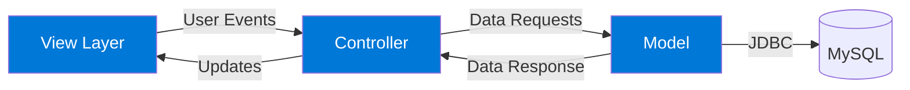
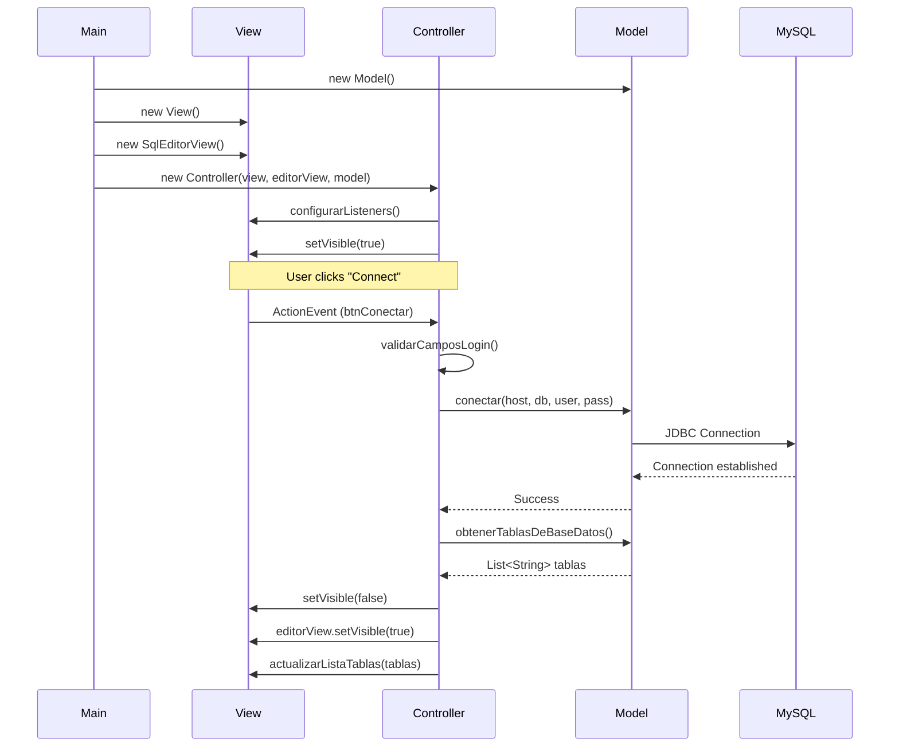

The MySQL SQL Editor implements the classic **Model-View-Controller (MVC)** design pattern to separate data management, user interface, and application logic.

## MVC Architecture Overview



<Note>
  The MVC pattern ensures that changes to the UI don't affect data handling, and business logic remains independent of the presentation layer.
</Note>

## Model Layer

### Model.java - Data Access Layer

The Model is responsible for all database interactions and maintains the connection state.

**Location**: `com.app.Model.Model`

#### Key Responsibilities

<CardGroup cols={2}>
  <Card title="Connection Management" icon="plug">
    Establishes and maintains MySQL database connections
  </Card>
  <Card title="Query Execution" icon="terminal">
    Executes SQL queries and returns results as table models
  </Card>
  <Card title="Metadata Retrieval" icon="list">
    Fetches database and table information
  </Card>
  <Card title="Data Transformation" icon="arrows-rotate">
    Converts ResultSet to DefaultTableModel for UI display
  </Card>
</CardGroup>

#### Core Methods

```java
public class Model {
    private Connection conexion;
    
    // Establish connection to a specific database
    public void conectar(String host, String database, 
                        String usuario, String password) throws SQLException
    
    // Close active database connection
    public void desconectar() throws SQLException
    
    // Retrieve all available databases (excluding system DBs)
    public List<String> obtenerTodasLasBasesDatos(String host, 
                                                   String usuario, 
                                                   String password) throws SQLException
    
    // Get tables from currently connected database
    public List<String> obtenerTablasDeBaseDatos() throws SQLException
    
    // Execute SQL query and return results as table model
    public DefaultTableModel ejecutarConsulta(String query) throws SQLException
}
```

<Accordion title="Connection Method Example">
  ```java
  public void conectar(String host, String database, String usuario, String password) 
      throws SQLException {
      conexion = DriverManager.getConnection(
          "jdbc:mysql://" + host + ":3306/" + database + "?useSSL=false",
          usuario,
          password
      );
  }
  ```
  
  This method constructs a JDBC URL and establishes a connection using `DriverManager`.
</Accordion>

<Accordion title="Query Execution Logic">
  The `ejecutarConsulta()` method handles both SELECT and data modification queries:
  
  ```java
  public DefaultTableModel ejecutarConsulta(String query) throws SQLException {
      try (Statement stmt = conexion.createStatement()) {
          String trimmedQuery = query.trim().toLowerCase();
          DefaultTableModel modelo = new DefaultTableModel();

          if (trimmedQuery.startsWith("select")) {
              // Handle SELECT queries - return result set
              try (ResultSet rs = stmt.executeQuery(query)) {
                  ResultSetMetaData meta = rs.getMetaData();
                  int columnas = meta.getColumnCount();
                  
                  // Add column headers
                  for (int i = 1; i <= columnas; i++) {
                      modelo.addColumn(meta.getColumnName(i));
                  }
                  
                  // Add data rows
                  while (rs.next()) {
                      Object[] fila = new Object[columnas];
                      for (int i = 0; i < columnas; i++) {
                          fila[i] = rs.getObject(i + 1);
                      }
                      modelo.addRow(fila);
                  }
              }
          } else {
              // Handle INSERT, UPDATE, DELETE, etc.
              int filasAfectadas = stmt.executeUpdate(query);
              // Extract table name and show updated data
              String tabla = extraerNombreTabla(trimmedQuery);
              // ... returns table contents or affected rows count
          }
          
          return modelo;
      }
  }
  ```
  
  <Info>
    The method intelligently returns either query results or the updated table contents after modifications.
  </Info>
</Accordion>

## View Layer

The application has two distinct views, both built with Java Swing:

### View.java - Login Interface

**Location**: `com.app.View.View`

The login view handles database connection setup.

#### UI Components

- **JComboBox** `cmbServidores` - Server selection (localhost, 127.0.0.1)
- **JTextField** `txtUsuario` - Username input
- **JPasswordField** `txtPassword` - Password input  
- **JComboBox** `cbBasesDatos` - Database selection dropdown
- **JButton** `btnConectar` - Initiates connection
- **JButton** `btnActualizarBases` - Refreshes database list
- **JButton** `btnSalir` - Exits application
- **JLabel** `lblEstado` - Displays error messages

#### Key Methods

```java
public class View extends JFrame {
    // Getters for user input
    public String getUsuario()
    public String getPassword()
    public String getServidor()
    public String getBaseDatosSeleccionada()
    
    // Button accessors for controller
    public JButton getBtnConectar()
    public JButton getBtnSalir()
    public JButton getBtnActualizarBases()
    
    // UI update methods
    public void setBasesDatos(List<String> bases)
    public void mostrarError(String mensaje)
    public void limpiarEstado()
    public void bloquearInterfaz(boolean bloquear)
}
```

<Accordion title="Custom Styling">
  The view uses custom color scheme matching the brand:
  
  ```java
  private final Color COLOR_PRIMARIO = new Color(0, 120, 215); // #0078D7
  private final Color COLOR_SECUNDARIO = new Color(100, 180, 255);
  private final Color COLOR_TEXTO = new Color(60, 60, 60);
  ```
  
  Buttons include hover effects for better UX:
  
  ```java
  boton.addMouseListener(new java.awt.event.MouseAdapter() {
      public void mouseEntered(java.awt.event.MouseEvent evt) {
          boton.setBackground(primario ? COLOR_PRIMARIO.darker() : 
                              COLOR_SECUNDARIO.darker());
      }
      public void mouseExited(java.awt.event.MouseEvent evt) {
          boton.setBackground(primario ? COLOR_PRIMARIO : COLOR_SECUNDARIO);
      }
  });
  ```
</Accordion>

### SqlEditorView.java - SQL Editor Interface

**Location**: `com.app.View.SqlEditorView`

The main editor view for writing and executing SQL queries.

#### UI Components

- **JTextArea** `txtConsulta` - SQL query editor with monospace font
- **JTable** `tblResultados` - Displays query results
- **JList** `listaTablas` - Shows available tables (double-click to generate SELECT)
- **JTextField** `txtBaseDeDatos` - Shows current database connection
- **JButton** `btnEjecutar` - Executes the SQL query
- **JButton** `btnLimpiar` - Clears editor and results
- **JButton** `btnRefrescarTablas` - Refreshes table list
- **JButton** `btnCambiarBD` - Disconnects and returns to login
- **JLabel** `lblMensajeSistema` - Shows query execution status

#### Key Methods

```java
public class SqlEditorView extends JFrame {
    // Input retrieval
    public String getConsulta()
    
    // Button accessors
    public JButton getBtnEjecutar()
    public JButton getBtnLimpiar()
    public JButton getBtnRefrescarTablas()
    public JButton getBtnCambiarBD()
    
    // UI updates
    public void setResultados(javax.swing.table.TableModel model)
    public void setMensajeSistema(String mensaje)
    public void limpiar()
    public void setBaseDeDatos(String nombreBD)
    public void actualizarListaTablas(List<String> tablas)
}
```

<Accordion title="Interactive Features">
  Double-clicking a table name auto-generates a SELECT query:
  
  ```java
  listaTablas.addMouseListener(new MouseAdapter() {
      public void mouseClicked(MouseEvent evt) {
          if (evt.getClickCount() == 2) {
              String tablaSeleccionada = listaTablas.getSelectedValue();
              if (tablaSeleccionada != null) {
                  String consulta = "SELECT * FROM " + tablaSeleccionada + " LIMIT 100";
                  txtConsulta.setText(consulta);
              }
          }
      }
  });
  ```
</Accordion>

## Controller Layer

### Controller.java - Application Logic Coordinator

**Location**: `com.app.Controller.Controller`

The Controller bridges the Model and Views, handling all user interactions.

#### Initialization

```java
public class Controller {
    private final View loginView;
    private final SqlEditorView editorView;
    private final Model modelo;

    public Controller(View loginView, SqlEditorView editorView, Model model) {
        this.loginView = loginView;
        this.editorView = editorView;
        this.modelo = model;

        configurarListeners();
        loginView.setVisible(true);
    }
}
```

<Info>
  The Controller receives references to both views and the model, then registers event listeners for all user actions.
</Info>

#### Event Handling

The Controller configures listeners for all interactive components:

<Steps>
  <Step title="Login View Listeners">
    ```java
    loginView.getBtnActualizarBases().addActionListener(e -> {
        loginView.limpiarEstado();
        validarCamposLogin(true);
        cargarBasesDatos();
    });

    loginView.getBtnConectar().addActionListener(e -> {
        loginView.limpiarEstado();
        if(validarCamposLogin(false)) {
            conectarABaseDatos();
        }
    });

    loginView.getBtnSalir().addActionListener(e -> System.exit(0));
    ```
  </Step>
  
  <Step title="Editor View Listeners">
    ```java
    editorView.getBtnEjecutar().addActionListener(e -> ejecutarConsulta());
    editorView.getBtnLimpiar().addActionListener(e -> limpiarEditor());
    editorView.getBtnRefrescarTablas().addActionListener(e -> refrescarTablas());
    
    editorView.getBtnCambiarBD().addActionListener(e -> {
        int confirm = JOptionPane.showConfirmDialog(editorView,
            "¿Desea desconectarse y cambiar de base de datos?",
            "Confirmar",
            JOptionPane.YES_NO_OPTION);

        if (confirm == JOptionPane.YES_OPTION) {
            desconectar();
        }
    });
    ```
  </Step>
</Steps>

#### Core Controller Methods

<Accordion title="validarCamposLogin()">
  ```java
  private boolean validarCamposLogin(boolean soloCredenciales) {
      if(loginView.getUsuario().isEmpty()) {
          loginView.mostrarError("El usuario es requerido");
          return false;
      }

      if(loginView.getPassword().isEmpty()) {
          loginView.mostrarError("La contraseña es requerida");
          return false;
      }

      if(!soloCredenciales && loginView.getBaseDatosSeleccionada() == null) {
          loginView.mostrarError("Debe seleccionar una base de datos");
          return false;
      }

      return true;
  }
  ```
  
  Validates user input before attempting database operations.
</Accordion>

<Accordion title="cargarBasesDatos()">
  ```java
  private void cargarBasesDatos() {
      if(!validarCamposLogin(true)) return;

      loginView.bloquearInterfaz(true);

      SwingWorker<List<String>, Void> worker = new SwingWorker<>() {
          @Override
          protected List<String> doInBackground() throws Exception {
              return modelo.obtenerTodasLasBasesDatos(
                  loginView.getServidor(),
                  loginView.getUsuario(),
                  loginView.getPassword()
              );
          }

          @Override
          protected void done() {
              loginView.bloquearInterfaz(false);
              try {
                  List<String> bases = get();
                  if (bases.isEmpty()) {
                      loginView.mostrarError("No se encontraron bases de datos");
                  } else {
                      loginView.setBasesDatos(bases);
                      JOptionPane.showMessageDialog(loginView,
                          "Bases de datos actualizadas correctamente",
                          "Éxito", JOptionPane.INFORMATION_MESSAGE);
                  }
              } catch (Exception ex) {
                  loginView.mostrarError("Error: " + ex.getMessage());
              }
          }
      };

      worker.execute();
  }
  ```
  
  Uses SwingWorker to load databases asynchronously, preventing UI freeze.
</Accordion>

<Accordion title="conectarABaseDatos()">
  ```java
  private void conectarABaseDatos() {
      loginView.bloquearInterfaz(true);

      SwingWorker<Boolean, Void> worker = new SwingWorker<>() {
          @Override
          protected Boolean doInBackground() throws Exception {
              modelo.conectar(
                  loginView.getServidor(),
                  loginView.getBaseDatosSeleccionada(),
                  loginView.getUsuario(),
                  loginView.getPassword()
              );
              return true;
          }

          @Override
          protected void done() {
              loginView.bloquearInterfaz(false);
              try {
                  get();
                  String nombreBD = loginView.getBaseDatosSeleccionada();
                  editorView.setBaseDeDatos(nombreBD);

                  List<String> tablas = modelo.obtenerTablasDeBaseDatos();
                  editorView.actualizarListaTablas(tablas);

                  loginView.setVisible(false);
                  editorView.setVisible(true);
              } catch (Exception ex) {
                  editorView.setBaseDeDatos(null);
                  editorView.actualizarListaTablas(Collections.emptyList());
                  loginView.mostrarError("Error de conexión: " + ex.getMessage());
              }
          }
      };

      worker.execute();
  }
  ```
  
  Connects to the database and transitions from login view to editor view upon success.
</Accordion>

<Accordion title="ejecutarConsulta()">
  ```java
  private void ejecutarConsulta() {
      if(editorView.getConsulta().trim().isEmpty()) {
          JOptionPane.showMessageDialog(editorView,
              "Ingrese una consulta SQL",
              "Advertencia", JOptionPane.WARNING_MESSAGE);
          return;
      }

      SwingWorker<DefaultTableModel, Void> worker = new SwingWorker<>() {
          @Override
          protected DefaultTableModel doInBackground() throws Exception {
              return modelo.ejecutarConsulta(editorView.getConsulta());
          }

          @Override
          protected void done() {
              try {
                  DefaultTableModel modelo = get();
                  editorView.setResultados(modelo);
                  editorView.setMensajeSistema("Consulta ejecutada correctamente");
              } catch (Exception ex) {
                  editorView.setMensajeSistema("Error: " + ex.getMessage());
                  JOptionPane.showMessageDialog(editorView,
                      "Error en la consulta: " + ex.getMessage(),
                      "Error", JOptionPane.ERROR_MESSAGE);
              }
          }
      };

      worker.execute();
  }
  ```
  
  Executes SQL queries asynchronously and updates the UI with results or errors.
</Accordion>

## Application Initialization

### Main.java - Entry Point

**Location**: `com.app.Main`

The Main class bootstraps the MVC components:

```java
public class Main {
    public static void main(String[] args) {
        // Instantiate the model
        Model model = new Model();

        // Instantiate the login view
        View loginView = new View();

        // Instantiate the SQL editor view
        SqlEditorView editorView = new SqlEditorView();

        // Hide the editor initially
        editorView.setVisible(false);

        // Create the controller, connecting model and views
        new Controller(loginView, editorView, model);
    }
}
```

<Steps>
  <Step title="Model Creation">
    A single Model instance is created to manage all database operations.
  </Step>
  
  <Step title="View Instantiation">
    Both views are created upfront. The editor view is hidden initially.
  </Step>
  
  <Step title="Controller Wiring">
    The Controller receives all three components and sets up the event handling infrastructure.
  </Step>
  
  <Step title="Display Login">
    The Controller shows the login view, and the application is ready for user interaction.
  </Step>
</Steps>

## MVC Interaction Sequence



## Benefits of This MVC Implementation

<CardGroup cols={2}>
  <Card title="Loose Coupling" icon="link-slash">
    Views don't directly interact with the Model, only through the Controller
  </Card>
  <Card title="Single Responsibility" icon="bullseye">
    Each class has one clear purpose: data, UI, or coordination
  </Card>
  <Card title="Easy Testing" icon="vial">
    Model logic can be unit tested without UI dependencies
  </Card>
  <Card title="Async by Default" icon="clock">
    Controller uses SwingWorker for all I/O operations
  </Card>
</CardGroup>

## Next Steps

<Card title="Component Documentation" icon="cube" href="/architecture/components">
  Explore detailed documentation for each component including all methods and their signatures
</Card>