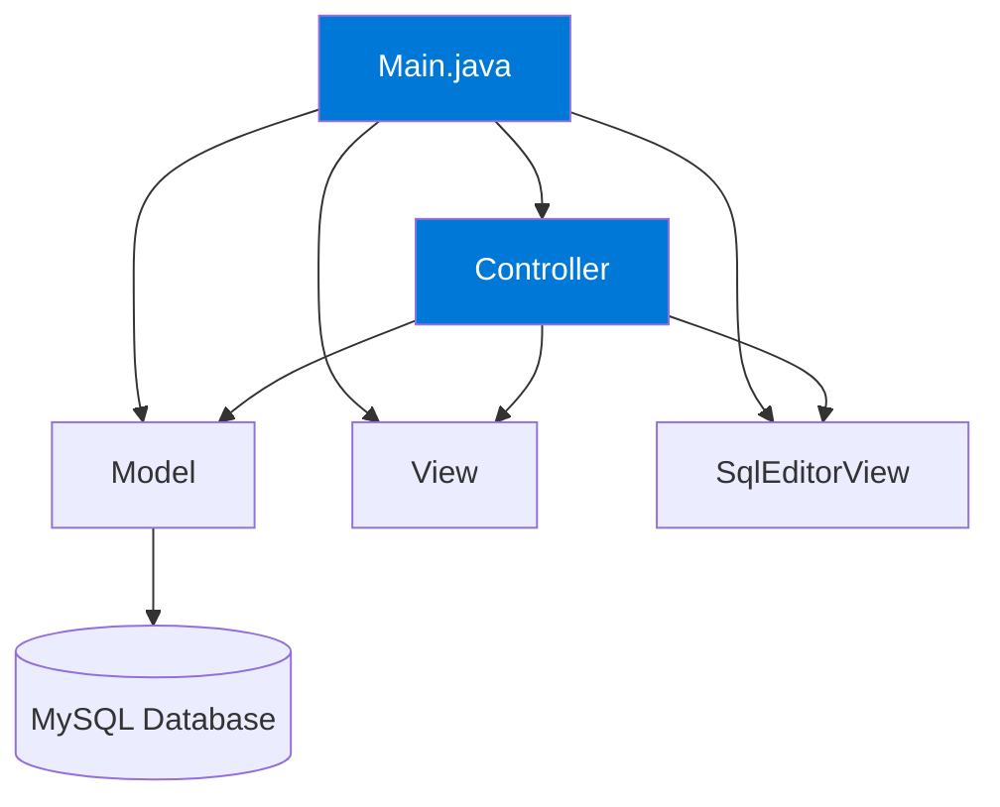
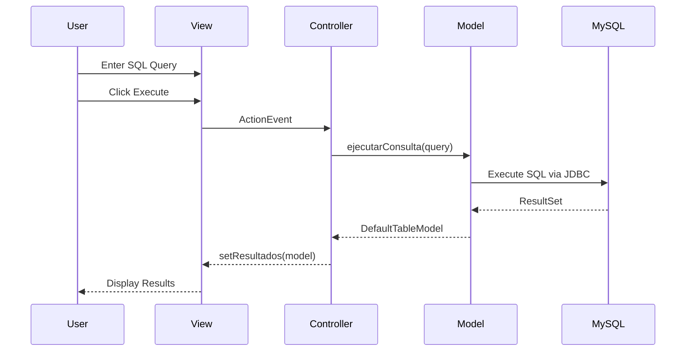

The MySQL SQL Editor is built using a clean **Model-View-Controller (MVC)** architectural pattern, implemented in Java Swing. This architecture ensures separation of concerns, maintainability, and scalability.

## Architecture Diagram



## Core Components

<CardGroup cols={3}>
  <Card title="Model" icon="database" color="#0078D7">
    Manages database connections and SQL operations using JDBC
  </Card>
  <Card title="View" icon="window" color="#0078D7">
    Two Swing-based views: login interface and SQL editor interface
  </Card>
  <Card title="Controller" icon="gears" color="#0078D7">
    Coordinates user actions, connects views to model logic
  </Card>
</CardGroup>

## Package Structure

The application is organized into a clear package hierarchy:

<Accordion title="com.app (Root Package)">
  Contains the `Main.java` entry point that bootstraps the entire application.
</Accordion>

<Accordion title="com.app.Model">
  Contains `Model.java` - the data access layer that handles all database operations including:
  - Connection management
  - Query execution
  - Metadata retrieval
</Accordion>

<Accordion title="com.app.View">
  Contains two view classes:
  - `View.java` - Login interface for database connection
  - `SqlEditorView.java` - Main SQL editor interface with query execution
</Accordion>

<Accordion title="com.app.Controller">
  Contains `Controller.java` which orchestrates interactions between the model and views.
</Accordion>

## Component Interaction Flow

<Steps>
  <Step title="Application Initialization">
    `Main.java` creates instances of Model, View, SqlEditorView, and Controller. The editor view is initially hidden.
    
    ```java
    Model model = new Model();
    View loginView = new View();
    SqlEditorView editorView = new SqlEditorView();
    editorView.setVisible(false);
    new Controller(loginView, editorView, model);
    ```
  </Step>
  
  <Step title="User Authentication">
    The Controller registers event listeners on the login view. When the user clicks "Connect", the Controller validates credentials and calls `Model.conectar()`.
  </Step>
  
  <Step title="Database Connection">
    The Model establishes a JDBC connection to the MySQL database and retrieves available tables using `Model.obtenerTablasDeBaseDatos()`.
  </Step>
  
  <Step title="Editor Display">
    Upon successful connection, the Controller hides the login view and displays the SqlEditorView with the table list populated.
  </Step>
  
  <Step title="Query Execution">
    User enters SQL queries in the editor. The Controller calls `Model.ejecutarConsulta()` which returns a `DefaultTableModel` displayed in the results table.
  </Step>
</Steps>

## Data Flow

### UI to Database



<Info>
  All database operations follow this unidirectional flow, ensuring data consistency and clear responsibility boundaries.
</Info>

### Database to UI

When loading tables or refreshing data:

1. Controller initiates a request (e.g., `refrescarTablas()`)
2. Model queries MySQL metadata using `DatabaseMetaData`
3. Model returns a `List<String>` of table names
4. Controller passes the list to the view
5. View updates the UI components (JList, JTable)

## Asynchronous Operations with SwingWorker

<Note>
  All potentially long-running database operations are executed asynchronously using **SwingWorker** to prevent UI freezing.
</Note>

The Controller uses SwingWorker for:

- **Loading databases**: `obtenerTodasLasBasesDatos()`
- **Connecting to database**: `conectar()`
- **Executing queries**: `ejecutarConsulta()`
- **Refreshing table list**: `obtenerTablasDeBaseDatos()`

### SwingWorker Pattern Example

```java
SwingWorker<DefaultTableModel, Void> worker = new SwingWorker<>() {
    @Override
    protected DefaultTableModel doInBackground() throws Exception {
        // Database operation runs in background thread
        return modelo.ejecutarConsulta(editorView.getConsulta());
    }

    @Override
    protected void done() {
        // UI update runs on Event Dispatch Thread
        try {
            DefaultTableModel modelo = get();
            editorView.setResultados(modelo);
            editorView.setMensajeSistema("Consulta ejecutada correctamente");
        } catch (Exception ex) {
            editorView.setMensajeSistema("Error: " + ex.getMessage());
        }
    }
};
worker.execute();
```

This pattern ensures:
- UI remains responsive during database operations
- Proper thread safety (UI updates only on EDT)
- Clean error handling with user feedback

## Key Architectural Benefits

<CardGroup cols={2}>
  <Card title="Separation of Concerns" icon="layer-group">
    Each component has a single, well-defined responsibility
  </Card>
  <Card title="Testability" icon="flask">
    Model can be tested independently of UI components
  </Card>
  <Card title="Maintainability" icon="wrench">
    Changes to UI don't affect business logic and vice versa
  </Card>
  <Card title="Scalability" icon="chart-line">
    New views or database operations can be added without restructuring
  </Card>
</CardGroup>

## Next Steps

<CardGroup cols={2}>
  <Card title="MVC Pattern Deep Dive" icon="code" href="/architecture/mvc-pattern">
    Learn how the MVC pattern is implemented in detail
  </Card>
  <Card title="Component Documentation" icon="cube" href="/architecture/components">
    Explore each component's methods and responsibilities
  </Card>
</CardGroup>